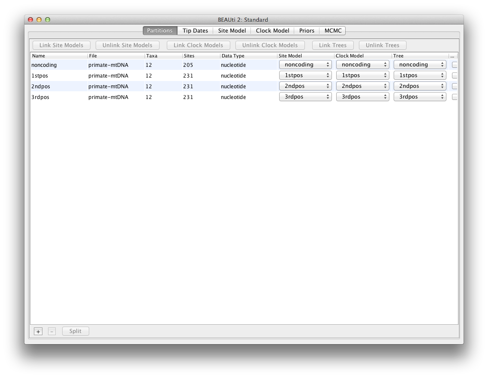
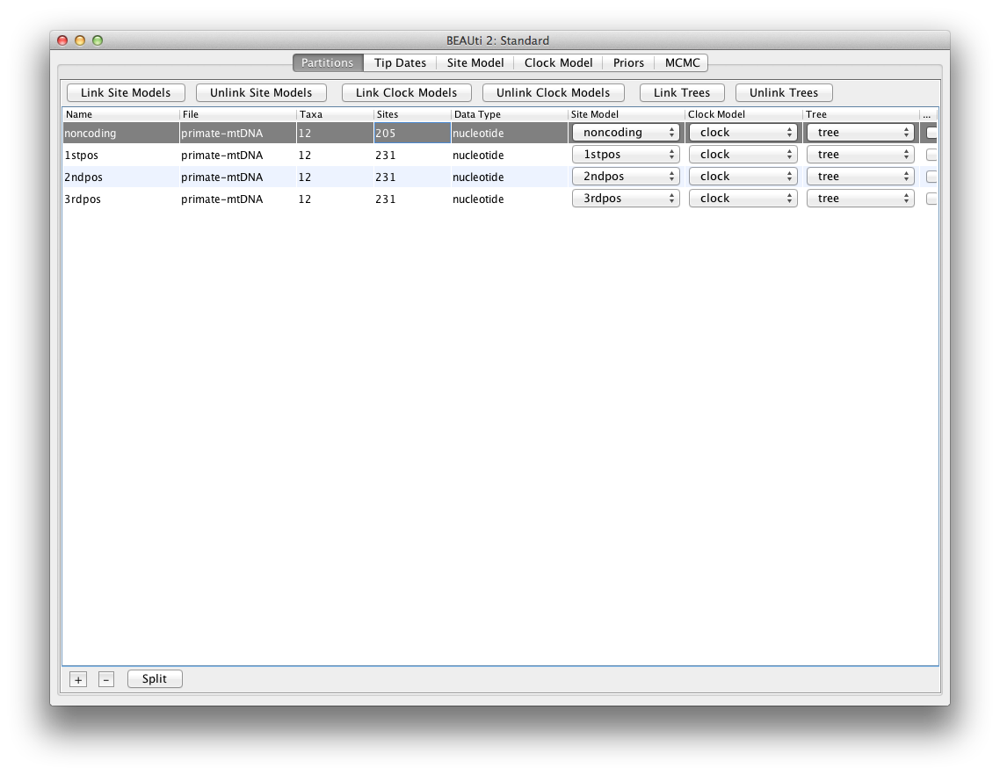
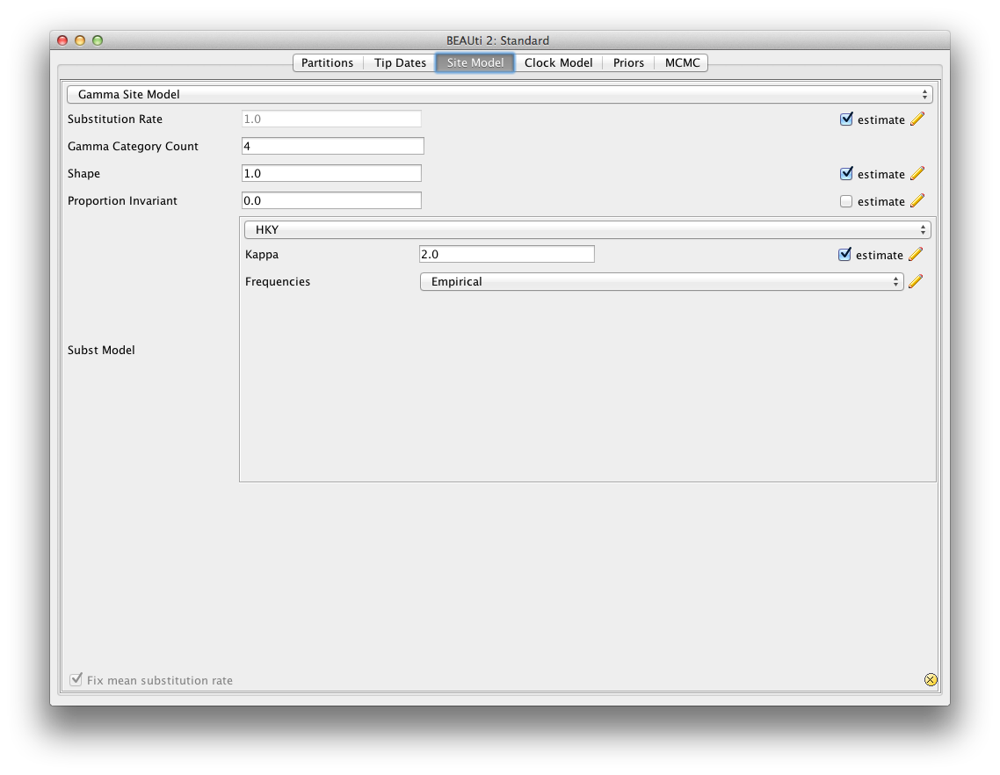
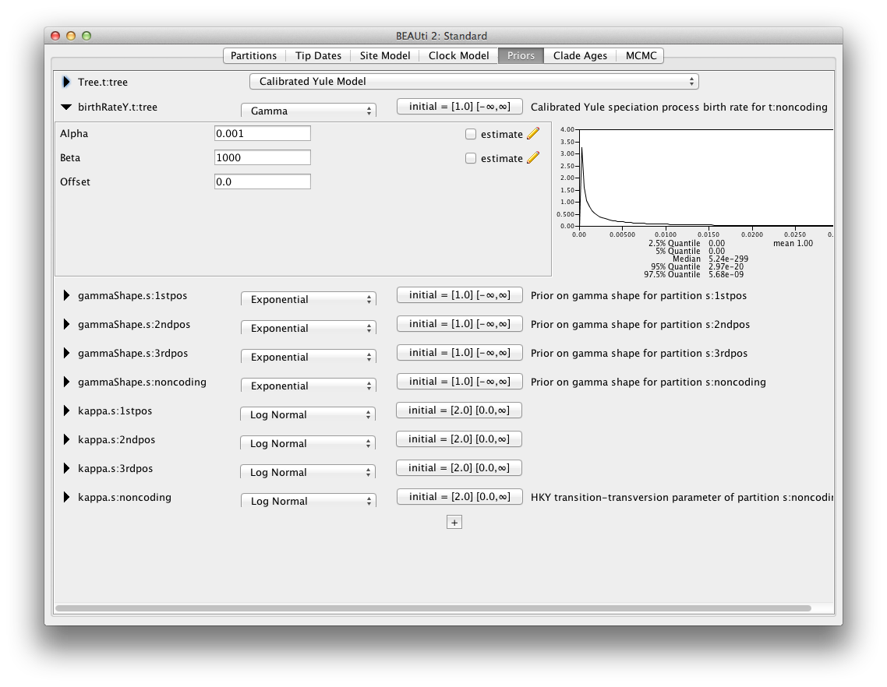
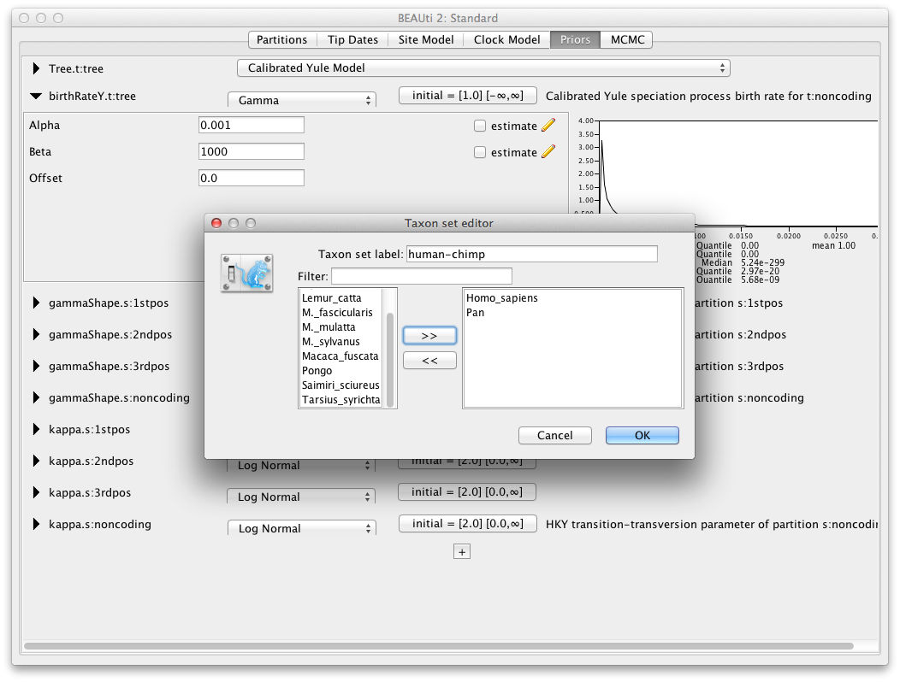
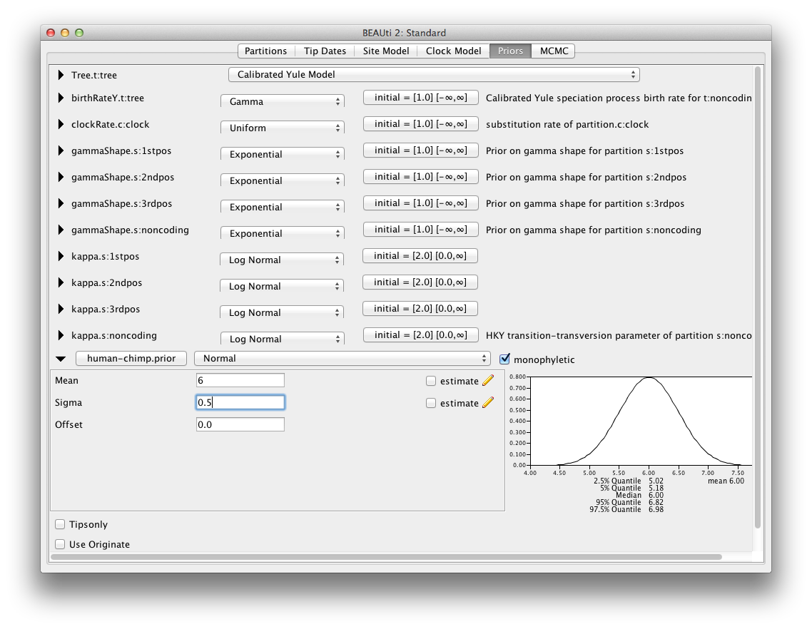
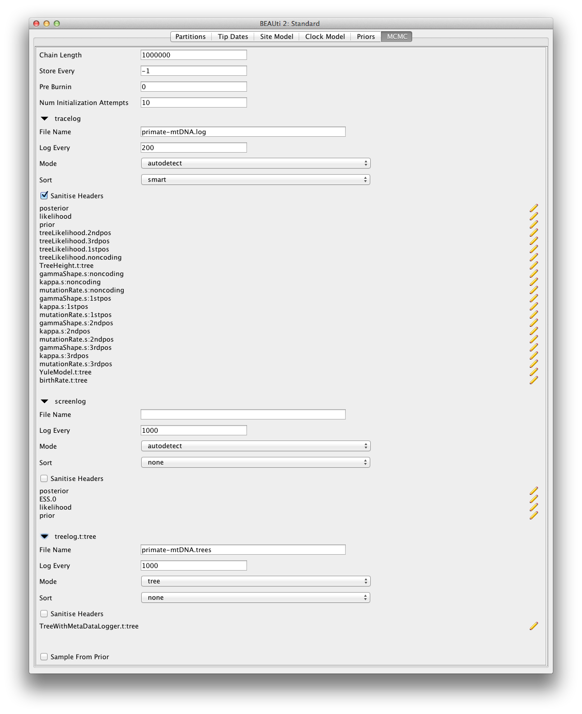

## Background

Before diving into performing complex analyses with the BEAST2 one needs to understand the basic workflow and concepts. While BEAST2 tries to be as user-friendly as possible, the amount of possibilities can be overwhelming.

Therefore, in this simple tutorial you will get acquainted with the basic workflow of BEAST2 and the software most commonly used to interpret the results of the analyses. Bear in mind that this tutorial is designed just to help you get started using BEAST2. We will not discuss all the choices and concepts in detail, as they will be sequentially discussed in further classes and tutorials.

----

## Programs used in this Exercise 

### BEAST2 - Bayesian Evolutionary Analysis Sampling Trees 2

BEAST2 is a free software package for Bayesian evolutionary analysis of molecular sequences using MCMC and strictly oriented toward inference using rooted, time-measured phylogenetic trees. This tutorial uses the BEAST2 version 2.4.2.

### BEAUti - Bayesian Evolutionary Analysis Utility

BEAUti is a graphical user interface tool for generating BEAST2 XML configuration files.

Both BEAST2 and BEAUti are Java programs, which means that the exact same code runs on all platforms. For us it simply means that the interface will be exactly the same on all platforms. The screenshots used in this tutorial are taken on a Mac OS X computer; however, both programs will have the same layout and functionality on both Windows and Linux.

### TreeAnnotator

TreeAnnotator is used to summarize the posterior sample of trees to produce a maximum clade credibility tree. It can also be used to summarise and visualise the posterior estimates of other tree parameters (e.g. node height).

TreeAnnotator is provided as a part of the BEAST2 tool package so you do not need to install it separately.

### DensiTree

Bayesian analysis using BEAST2 provides an estimate of the uncertainty in tree space. This distribution is represented by a set of trees, which can be rather large and difficult to interpret. DensiTree is a program for qualitative analysis of sets of trees. DensiTree allows to quickly get an impression of properties of the tree set such as well-supported clades, distribution of tree heights and areas of topological uncertainty.

DensiTree is provided as a part of the BEAST2 tool package so you do not need to install it separately.

### Tracer

[Tracer](http://tree.bio.ed.ac.uk/software/tracer) is used to summarise the posterior estimates of the various parameters sampled by the Markov chain. This program can be used for visual inspection and assessment of convergence. It helps to quickly view median estimates 95% highest posterior density intervals of the parameters, and calculates the effective sample sizes (ESS) of parameters. It also helps to visualise potential parameter correlations.

### FigTree

[FigTree](http://tree.bio.ed.ac.uk/software/figtree) is a program for viewing trees and producing publication-quality figures. It can interpret the node-annotations created on the summary trees by TreeAnnotator, allowing the user to display node-based statistics (e.g. posterior probabilities).

----

## Practical: Running a simple analysis with BEAST2

This tutorial will guide you through the analysis of an alignment of sequences sampled from twelve primate species. The aim of this tutorial is to co-estimate the following:

1. The gene phylogeny;
2. The rate of evolution on each lineage based on divergence times of their host species.

More generally, this tutorial aims to introduce new users to a basic workflow and point out the steps towards performing a full analysis of sequencing data within Bayesian framework.

### Creating analysis configuration

To run analyses with BEAST, one needs to prepare a configuration file in XML format that contains all the input information and setup of initial values and priors. Even though it is possible to create such files by hand from scratch, it can be complicated and not exactly straightforward. BEAUti is designed to aid you in producing a valid setup file for BEAST. If necessary that file can later be edited by hand, but it is recommended to use BEAUti for generating the files at least for the initial round of analysis.

> Begin by starting up BEAUti.

### Loading the data

In the folder with the extracted tutorial materials you should see the `Data` folder containing a single NEXUS file. This file contains sequences and meta-information on the twelve primate mitochondrial genomes which we will be analysing.

To give BEAST2 access to the data, one has to add the alignment to the configuration file. To do this, open BEAUti and either drag and drop the Nexus file into the open BEAUti window (it should be on `Partitions` tab), or use `File > Import Alignment` and then locate and click the alignment file.

> Import the alignment into BEAUti by either dragging and dropping the `*.nex` file into the BEAUti window open on the Partitions tab, or use `File > Import Alignment` and then locate and click the alignment file.

Once you have done that, the data should appear in the BEAUti window which should look as shown in [Figure 1](#fig:data).

<figure>
	
	
	<figcaption>Figure 1: Data imported into BEAUti.</figcaption>
</figure>

### Setting up shared models

One way to account for variation in substitution rates between different sites is to include gamma rate categories. In this scenario, one defines a Gamma distribution and discretises it in the desired number of bins (4-6 usually). The mean of each bin is then acting as a multiplier for the overall substitution rate. The transitions probabilities are then calculated for each scaled substitution rate. P(data | tree, substitution model) can then be calculated under each gamma rate category and the results are summed up to average over all possible rates. This is a handy approach if one suspects that some sites can be mutating faster than others but the precise position of the sites in the alignment is unknown or random.

Another way to account for site rate heterogeneity is to split the alignment into explicit partitions. This is especially relevant, when one knows exactly which positions in the alignment have different substitution rates from the rest of the sites. In our example, we split the alignment into coding and non-coding parts, and split the coding part further into 1st, 2nd and 3rd codon positions. We can now specify a separate substitution model for each partition. 

Since all of the sequences in this data set are from the mitochondrial genome (which is not believed to undergo recombination in birds and mammals) they all share the same ancestry. By default BEAST2 would recover a time-tree for each partition, so we need to make sure that it uses all data to recover a single shared tree. For the sake of simplicity, we will also assume the partitions have the same evolutionary rate for each branch, and hence share the clock model as well.

To make sure that the partitions share the same evolutionary history we need to link the clock model and the tree in BEAUti, which can be done by selecting all four partitions and clicking the `Link Trees` and `Link Clock Models` buttons.

> Select all four data partitions the `Partitions` panel and click the `Link Trees` and `Link Clock Models` buttons.

You will see that the `Clock Model` and the `Tree` columns in the table both changed to say `noncoding`. Now we will rename both models such that the following options and generated log files more easy to read. The resulting setup should look as shown in [Figure 2](#fig:link).

> Click on the first drop-down menu in the `Clock Model` column and rename the shared clock model to `clock`.
>
> Likewise rename the shared tree to `tree`.

<figure>
	
	
	<figcaption>Figure 2: Linked models.</figcaption>
</figure>

### Setting the substitution model

Next we need to set up the substitution model in the `Site Model` tab.

> Select the `Site Model` tab.

The options available in this panel depend on whether the alignment data is in nucleotides, aminoacids, binary data or general data. The settings available after loading the alignment will contain the default values which we normally want to modify.

The panel on the left shows each part of the alignment. Remember that we did not link the substitution models in the previous step for the different partition, so each partition is allowed to evolve under different substitution model, i.e. we assume that different positions in the alignment accumulate substitutions differently. We will need to set the site substitution model separately for each part of the alignment as these models are unlinked. However, we think that all partitions evolve according to the same model (although with different parameters) so we can temporarily link the site models in the `Partitions` panel so that we can change the model of all partitions simultaneously. 

Navigate to the `Partitions` tab again, select all the partitions and temporarily link the site models. Then go back to the `Site Model` tab. The panel on the left is now gone as we are setting one model for all of the partitions.

> Go to the `Partitions` tab, select all partitions and click the `Link Site Models` button.
>
> Return to the `Site Model` tab.

First, check the `estimate` checkbox at the `Substitution Rate`, as we want to estimate relative substitution rates for each partition. Next, set the `Gamma Category Count  to 4 and check the `estimate` box for the `Shape` parameter. This will allow rate variation between sites in each partition to be modelled. Then select `HKY` in the `Subst Model` drop-down and select `Empirical` from the `Frequencies` drop-down. This will fix the frequencies to the proportions observed in the data (for each partition individually, once we unlink the site models again). This approach means that we can get a good fit to the data without explicitly estimating these parameters. The setup should look now as shown in [Figure 3](#fig:subst).

> Check the `estimate` checkbox at the `Substitution Rate`.
>
> Set the `Gamma Category Count` to 4.
> 
> Check the `estimate` box for the `Shape` parameter.
>
> Select `HKY` in the `Subst Model` drop-down.
> 
> Select `Empirical` from the `Frequencies` drop-down.

Now return to the `Partitions` panel and unlink the site models such that each partition has its own named site model with independent substitution model parameters and relative rate. You can make sure this is the case by returning to the `Site Model` tab and clicking through the different partitions. 

> Go to the `Partitions` tab again, select all partitions and click the `Unlink Site Models` button.

<figure>	
	
	
	<figcaption>Figure 3: Substitution model setup.</figcaption>
</figure>

### Setting the clock model

Next, select the `Clock Models` tab at the top of the main window. This is where we set up the molecular clock model. For this exercise we are going to leave the selection at the default value of a strict molecular clock, because this data is very clock-like and does not need rate variation among branches to be included in the model.

> Go to the \texttt{Clock Models} tab and view the setup.

### Setting priors

The `Priors` tab allows priors to be specified for each parameter in the model. The model selections made in the site model and clock model tabs, result in the inclusion of various parameters in the model. For each of these parameters a prior distribution needs to be specified.

Here we specify that we wish to use the Calibrated Yule model as the tree prior. This is a simple model of speciation that is generally more appropriate when considering sequences from different species.

> Go to the `Priors` tab and select the `Calibrated Yule Model` in the `Tree.t:tree` dropdown menu.

We will set the prior for `birthRateY.t:tree` to a `Gamma` distribution with an `Alpha` of 0.001 and `Beta` of 1000.

> For `birthRateY.t:tree` select `Gamma` from the dropdown menu
> 
> Expand the options for `birthRateY.t:tree` using the arrow button on the right.
>
> Set the `Alpha` (shape) parameter to 0.001 and the `Beta` (scale) parameter to 1000.

We will leave the rest of the priors on their default values, which should look as shown in [Figure 4](#fig:priors).

Please note that in general using default priors is highly frowned upon as priors are meant to convey your prior knowledge of the parameters. It is important to know what exactly do the priors tell MCMC and whether this fits your particular situation. In our case the default priors are suitable for this particular analysis, however for further, more complex analyses, we will require a clear idea of what do the priors mean. Getting this understanding is hard so we will leave it to the later Taming the Beast classes and tutorials in order to keep the introduction as simple as possible.

<figure>
	
	
	<figcaption>Figure 4: Prior setup.</figcaption>
</figure>

### Adding a calibration node

Since all of the samples come from a single time point, there is no information on the actual height of the phylogenetic tree in time units. Tree height and substitution rate will not be distinguishable and BEAST2 will only be able to estimate their product. To give BEAST2 the possibility to separate these two parameters we need to input additional information that will help calibrate the tree in time.

Since in the Bayesian analysis such information should be encoded in the form of a prior distribution, we will have to add a new prior that is not available yet. To define an extra prior, press the small `+` button below list of priors. You will see a dialogue that allows you to define a subset of the taxa in the phylogenetic tree. Once you have created a taxa set you will be able to add calibration information for its most recent common ancestor (MRCA) later on.

> Click the small `+` button below all the priors.

Name the taxa set by filling in the taxon set label entry. Call it human-chimp (it will contain the taxa for Homo sapiens and Pan). In next list below you will see the available taxa. Select and add the Homo sapiens and Pan taxa to the set (see [Figure 5](#fig:taxa)). After you click `OK` and the newly defined taxa set will be added to the prior list.

> Set the `Taxon set label` to `human-chimp`.
>
> Locate `Homo_sapiens` taxon in the left hand side list and click the `>>` button to add it to the taxa set for `human-chimp`.
>
> Locate `Pan` taxon in the left hand side list and click the `>>` button to add it to the taxa set for `human-chimp`.
> 
> Click the `OK` button to add the newly defined taxa set to the prior list.

<figure>
	
	
	<figcaption>Figure 5: Calibration node taxa set definition.</figcaption>
</figure>

The new node we have added is a calibrated node to be used in conjunction with the Calibrated Yule prior. In order for that to work we need to enforce monophyly, so select the checkbox marked `Monophyletic`. This will constrain the tree topology so that the human-chimp grouping is kept monophyletic during the course of the MCMC analysis.

> Check the `monophyletic` checkbox next to the `human-chimp.prior`.

We now need to specify a prior distribution on the calibration node based on our prior fossil knowledge in order to calibrate our tree. Select the `Normal` distribution for the newly added `human-chimp.prior`. Expand the prior options and  specify a normal distribution centered at 6 million years with a standard deviation of 0.5 million years. This will give a central 95% range of about 5-7 million years. This roughly corresponds to the current consensus estimate of the date of the most recent common ancestor of humans and chimpanzees.

> Select the `Normal` distribution from the drop down menu to the right of the newly added `human-chimp.prior`.
>
> Expand the distribution options using the arrow button on the left.
>
> Set the `Mean` of the distribution to 6.
>
> Set the `Sigma` of the distribution to 0.5.

The final setup of the calibration node should look as shown in [Figure 6](#fig:calibration).

<figure>
	
	
	<figcaption>Figure 6: Calibration node prior setup.</figcaption>
</figure>

### Setting the MCMC options

Finally, the `MCMC` tab allows to control the length of the MCMC run and frequency of stored samples. It also allows one to change the output file names.

> Go to the `MCMC` tab.

The `Chain Length` parameter specifies the number of steps the MCMC chain will make before finishing. This number depends on the size of the dataset, the complexity of the model and the precision of the answer required. The default value of 10'000'000 is arbitrary and should be adjusted accordingly. For this small dataset we initially set the chain length to 1'000'000 such that this analysis will take only a few minutes on most modern computers (rather than hours). For now we leave the `Store Every` and `Pre Burnin` fields at their default values.

> Set the `Chain Length` to 1'000'000.

Below these general settings you will find the logging settings. Each particular logging option can be viewed in detail by clicking the arrow to the left of it. You can control the names of the log files and how often should the values be stored in each of the files.

Start by expanding the `tracelog` options. This is the log file you will use later to analyse and summarise the results of the run. The `Log Every` parameter for the log file should be set relative to the total length of the chain. Sampling too often will result in very large files with little extra benefit in terms of the accuracy of the analysis. Sampling too rarely will mean that the log file will not record sufficient information about the distributions of the parameters. We normally want to aim to store no more than 10'000 samples so this should be set to no less than chain length/10'000. For this analysis we will make BEAST2 write to log file every 200 samples.

> Expand the `tracelog` options.
> 
> Set the `Log Every` parameter to 200.

Then, expand the `screenlog` options. The screen output is simply for monitoring the program's progress. Since it is not so important, especially if you run your analysis on a remote computer or a computer cluster, the `Log Every` can be set to any value. Although if set too small, the sheer quantity of information being displayed on the screen will actually slow the program down. For this analysis we will make BEAST2 log to screen every 1'000 samples, which is the default setting.

> Expand the `screenlog` options.
>
> Leave the `Log Every` parameter at the default value of 1'000.

Finally, we can also change the tree logging frequency by expanding the `treelog.t:tree`. Set the sampling frequency to 1'000 and rename the tree log file to `primate-mtDNA.trees`.

> Expand the `treelog.t:tree` options.
>
> Set the `File Name` to `primate-mtDNA.trees`.
>
> Leave the `Log Every` parameter at the default value of 1'000.

The final setup should look as in [Figure 7](#fig:logs).

<figure>
	
	
	<figcaption>Figure 7: Logging options.</figcaption>
</figure>

### Generating the XML file

We are now ready to create the BEAST2 XML file. To do this, select `File > Save`, and save the file with an appropriate name (we usually end the filename with `.xml`, i.e. `Primates.xml`). This is the final configuration file BEAST2 can use to execute the analysis.

> Save the XML file under the name `Primates.xml` using `File > Save`.

